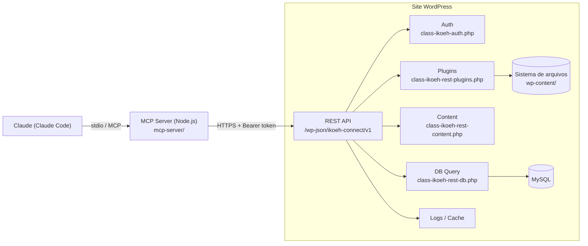
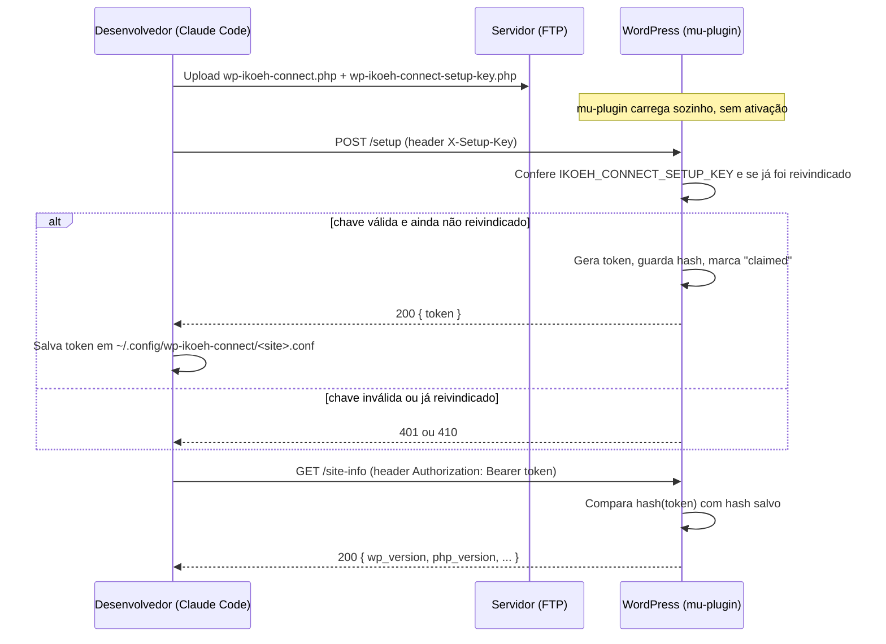
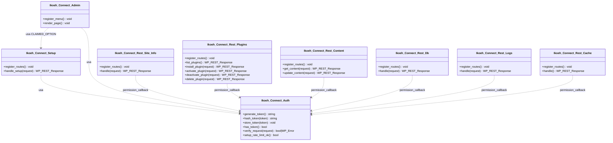

# WP iKOEH Connect: Design Spec

**Data:** 2026-07-27
**Status:** Aprovado, aguardando plano de implementação

## Contexto e objetivo

O Claude (via Claude Code) precisa de acesso direto e reutilizável a sites WordPress para desenvolver, otimizar e manter plugins e conteúdo, incluindo o plugin OAT (`~/ICP-LA/oat`), atualmente travado em deploy manual por FTP.

Em vez de resolver isso só para o OAT, o escopo foi ampliado: construir uma ferramenta genérica de conexão Claude ↔ WordPress, batizada **WP iKOEH Connect**, distribuída publicamente (marca ikoeh) para qualquer pessoa usar em qualquer site.

Primeiro site de teste real: **icp-la.com.br** (acesso disponível: FTP/SFTP via Hostinger; sem confirmação de acesso wp-admin).

## Arquitetura

Dois componentes, num único repositório público:

```
wp-ikoeh-connect/
  plugin/           # plugin WordPress (PHP)
  mcp-server/        # servidor MCP (Node.js)
  docs/
```

### Diagrama de componentes



### Diagrama de sequência: bootstrap do token (instalação via FTP/mu-plugin)



### 1. Plugin WordPress (`plugin/`)

- Nome: **WP iKOEH Connect**. Expõe uma REST API própria em `/wp-json/ikoeh-connect/v1/...`.
- **Compatível com dois modos de instalação, no mesmo código:**
  - **Plugin normal**: zip enviado pelo wp-admin, ativado por lá. Fluxo padrão para quem baixa publicamente.
  - **mu-plugin**: arquivo solto direto em `wp-content/mu-plugins/`, carrega sozinho sem ativação. Necessário para sites só com acesso FTP (caso do icp-la.com.br hoje).
  - Consequência de design: nenhuma lógica crítica de setup pode depender de `register_activation_hook` (não dispara em mu-plugins). Geração do token acontece de forma preguiçosa/idempotente no boot do plugin.
- **Autenticação:** token bearer único por instalação.
  - Instalações com wp-admin: tela de configurações mostra/copia/regenera o token.
  - Instalações mu-plugin (sem wp-admin): o arquivo do plugin embute, no momento em que é gerado para upload, uma `SETUP_KEY` única. Um endpoint `POST /setup` (header `X-Setup-Key`) devolve o token real **uma única vez**; após o primeiro resgate, o endpoint se tranca permanentemente (flag salva como opção do WP).
  - O token é guardado no banco **com hash** (nunca em texto puro no WordPress). O texto puro só existe no arquivo de configuração local do MCP server.
- **Capacidades expostas (REST):**
  - `GET /site-info`: versão WP/PHP, tema ativo, lista de plugins.
  - `GET /plugins`, `POST /plugins/install` (upload de zip ou URL), `POST /plugins/{slug}/activate`, `POST /plugins/{slug}/deactivate`, `DELETE /plugins/{slug}`.
  - `GET /content/{post_id}`, `PUT /content/{post_id}`: post_content e postmeta, incluindo `_elementor_data` (registrado explicitamente para ficar visível via REST, já que por padrão o Elementor esconde esse meta).
  - `POST /db/query`: leitura livre; escrita (`INSERT`/`UPDATE`/`DELETE`) exige uma flag explícita `confirm_write: true` no payload.
  - `GET /logs/debug`: tail do `debug.log`.
  - `POST /cache/flush`.
- **Fora de escopo, por decisão de segurança:** nenhum endpoint de execução arbitrária de PHP ou shell. O risco (webshell completo caso o token vaze) supera o ganho de flexibilidade. Qualquer necessidade futura específica vira um endpoint novo e restrito, não uma porta genérica.
- **Tela de configurações (wp-admin):** usa os componentes nativos do admin do WordPress (`.wrap`, `.form-table`, `button-primary`, paleta do color-scheme ativo do usuário) em vez de um dashboard customizado. Fica visualmente parte do wp-admin, não um widget estranho colado por cima. Identidade ikoeh entra só no ícone do menu lateral e num acento de cor pontual (botão de copiar/regenerar token), sem gradientes ou cara de "dashboard de SaaS genérico".
- **Outras proteções:** HTTPS obrigatório (recusa requisições em HTTP puro), rate limiting no `/setup` (contador via transient) para dificultar força bruta da `SETUP_KEY`, validação de zip (só extrai como plugin válido, sem path traversal) nos endpoints de instalação.

### Diagrama de classes (plugin)



### 2. MCP Server (`mcp-server/`)

- Node.js, usando o SDK oficial de MCP (`@modelcontextprotocol/sdk`).
- Multi-site desde o início: cada site configurado vive em `~/.config/wp-ikoeh-connect/<site>.conf` (URL + token), no mesmo padrão já usado para credenciais de FTP neste ambiente.
- Cada capacidade do plugin vira uma tool MCP: `wp_site_info`, `wp_list_plugins`, `wp_deploy_plugin`, `wp_activate_plugin`, `wp_deactivate_plugin`, `wp_delete_plugin`, `wp_get_content`, `wp_update_content`, `wp_db_query` (com o mesmo requisito de `confirm_write` repassado), `wp_read_debug_log`, `wp_flush_cache`.

## Distribuição

1. **GitHub público** (`wp-ikoeh-connect`): código-fonte, releases versionadas (zip do plugin anexado a cada release). Canal principal para devs.
2. **`ikoeh.com/wpikoehconnect`**: página de apresentação/download no site institucional ikoeh (Astro), linkando para a release mais recente do GitHub. **Fase 2**, feita depois que o núcleo estiver validado em produção. Não bloqueia o desenvolvimento do plugin/MCP server.

## Plano de validação (site real: icp-la.com.br)

1. Gerar `SETUP_KEY` única, embutir no arquivo do plugin, subir via FTP em `wp-content/mu-plugins/` (mesmo mecanismo de deploy já usado nos outros sites deste ambiente).
2. Resgatar o token via `POST /setup`, salvar em `~/.config/wp-ikoeh-connect/icp-la.conf`.
3. Validar cada endpoint manualmente via `curl`.
4. Registrar o MCP server no Claude Code e confirmar uma tool ponta a ponta (ex.: `wp_list_plugins` retornando dados reais do site).
5. Só então: usar o canal para corrigir e publicar o plugin OAT no icp-la.com.br.

## Ambiente isolado e CI/CD

- **Ambiente local isolado:** `docker-compose.yml` na raiz do repositório sobe WordPress + MySQL efêmeros, com a pasta `plugin/` montada direto em `wp-content/mu-plugins/`. Serve para desenvolver e validar o plugin sem tocar em nenhum site real, inclusive antes do primeiro deploy em icp-la.com.br.
- **CI/CD (GitHub Actions):** workflow em `.github/workflows/ci.yml`, disparado em todo push e pull request, com três jobs:
  1. `php-lint`: roda `php -l` em todos os arquivos PHP do plugin.
  2. `mcp-server`: `npm ci` + checagem de sintaxe/import de todos os arquivos do MCP server.
  3. `integration`: sobe o mesmo `docker-compose.yml` do ambiente local, aguarda o WordPress ficar pronto, instala o WP via `wp-cli`, copia o plugin para `mu-plugins/`, e roda a mesma bateria de checagens `curl` usadas na validação manual (Task 8 do plano) contra esse WordPress descartável. Nenhum segredo de site real é usado nesse job.
- Isso cobre "testes automatizados" sem contradizer a decisão de não ter suíte unitária: são testes de integração contra um ambiente isolado e descartável, não mocks nem testes unitários de cada função PHP/JS isoladamente.
- Verificação manual via `curl` contra o site real (icp-la.com.br) continua sendo o passo final antes de considerar o canal pronto para uso, conforme o "Plano de validação" acima.

## Otimização de memória e processamento

- **`GET /logs/debug`:** em vez de carregar o `debug.log` inteiro em memória com `file()`, a leitura busca o fim do arquivo diretamente (seek a partir do final, lendo em blocos até acumular N linhas). Em sites esquecidos, esse log pode chegar a centenas de MB; carregar tudo pra devolver as últimas 100 linhas desperdiça memória e pode estourar o `memory_limit` do PHP em hospedagem compartilhada.
- **`POST /db/query`:** consultas `SELECT` sem `LIMIT` recebem um `LIMIT` automático (1000 linhas) antes de executar, evitando que uma query exploratória num site com tabelas grandes derrube o processo PHP por esgotamento de memória. O limite não se aplica se a query já tiver `LIMIT` próprio.
- **`POST /plugins/install`:** zips de plugin são tipicamente pequenos (dezenas de KB a poucos MB), então carregar o corpo da requisição inteiro em memória (`file_get_contents('php://input')` implícito via `$request->get_body()`) é aceitável; não há necessidade de streaming aqui.

## Licenciamento

- `plugin/`: GPLv2 or later (padrão para plugins WordPress, mesma licença já usada no OAT).
- `mcp-server/`: MIT.
